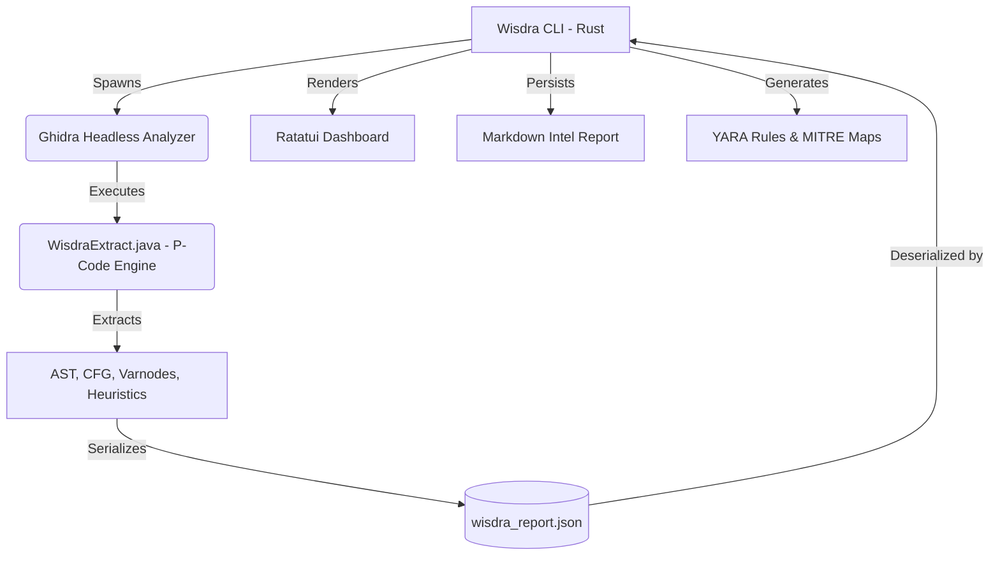

<p align="center">
  
  
  
  
</p>

<h1 align="center">WISDRA V2</h1>
<p align="center">
  <strong>Static Exploitability & Threat Intelligence Engine</strong>
</p>
<p align="center">
  A high-performance Rust engine orchestrating Ghidra's P-Code architecture to conduct deep <br/> static taint analysis, automated vulnerability discovery, and cyber defense signature generation.
</p>

---

## Overview

**Wisdra V2** transcends standard metadata extraction. It is a fully weaponized intelligence pipeline designed for zero-click binary analysis. By wrapping Ghidra's Headless Analyzer in a blazingly fast, memory-safe Rust orchestrator, Wisdra allows analysts to rip through suspicious executables, track malicious data flows, and instantly generate defensive countermeasures.

Featuring a Matrix-style terminal UI (TUI) powered by `ratatui` and an automated Markdown reporting engine, Wisdra translates raw opcodes into actionable threat intelligence.

## Key Capabilities

- **P-Code Taint Analysis (Vuln Hunter):** Recursive backward data-flow traversal identifying `CWE-190` (Integer Overflows into allocators) and `CWE-120/134` (Unbounded Memory Writes / Format Strings) by tracking untrusted variables to dangerous sinks (`memcpy`, `malloc`, etc.).
- **Auto-YARA Generation:** Dynamically builds deployable YARA rules from binary entropy, malicious API imports, and sanitized string extractions.
- **MITRE ATT&CK Matrix Mapping:** Automatically correlates discovered heuristics and API fingerprints to specific MITRE tactics and techniques (e.g., *T1055 Process Injection*, *T1622 Debugger Evasion*).
- **Interactive TUI Dashboard:** A professional terminal interface displaying real-time threat telemetry, vulnerability intelligence, and categorized suspicious operations.
- **SIGINT-Style Reporting:** Compiles a forensic, intelligence-grade Markdown report detailing the exact execution contexts and decompiled code blocks of discovered vulnerabilities.
- **High-Performance Rust Core:** Compiled with aggressive Link-Time Optimizations (LTO) and stripped symbols for maximum speed and minimal host footprint.

## Architecture

Wisdra V2 operates on a strict separation of concerns to bypass memory bottlenecks typically associated with JVM-based analysis:



## Installation

### Prerequisites
- [Rust](https://rustup.rs/) (1.70+)
- [Ghidra](https://github.com/NationalSecurityAgency/ghidra/releases) (11.x or 12.x)

### Build the Optimized Engine
```bash
git clone https://github.com/WiseHax/Wisdra.git
cd Wisdra
cargo build --release
```
The compiled, optimized binary will be located at `target/release/wisdra_core.exe`.

## Usage

Ensure the `GHIDRA_HOME` environment variable is mapped to your Ghidra installation, or provide the path via the `--ghidra-path` flag.

### Live-Fire Interactive Analysis
Launch the analysis and open the interactive TUI dashboard upon completion:
```powershell
$env:GHIDRA_HOME="C:\path\to\ghidra_12.1.3_PUBLIC"
.\target\release\wisdra_core.exe analyze "C:\Suspicious\malware.exe"
```

### Headless Triaging (No TUI)
For bulk scanning or pipeline integrations, bypass the TUI and directly export the forensic report:
```powershell
.\target\release\wisdra_core.exe analyze -n "C:\Suspicious\malware.exe"
```
*(The intelligence report and generated YARA rule will be saved to the `output/` directory).*

## Roadmap (V3 Future Targets)

While Wisdra V2 implements complete P-Code vulnerability hunting and YARA generation, the following upgrades are planned for the next evolutionary leap:

- [ ] **SQLite Persistence:** Implement a local database to track analysis history, hash cross-referencing, and persistent threat actor heuristics across multiple sessions.
- [ ] **ExposureZ3 Integration:** Bridge Wisdra's vulnerability findings into the Z3 SMT solver for automated exploit verification and dynamic constraint solving.
- [ ] **Multi-Binary Ingestion:** Support bulk directory scanning for automated triage of massive malware dumps.
- [ ] **LLM Heuristic Explanations:** Optional plugin to pipe decompiled C-code contexts to a local LLM for natural language vulnerability explanations.

## Disclaimer

Wisdra is a defensive security research tool intended solely for authorized binary analysis, malware research, and proactive cyber defense. The authors assume no liability for misuse. Ensure proper authorization before processing any binary.

---
<p align="center">
  <sub>Built with Rust & Ghidra — Weaponized for Threat Intelligence.</sub>
</p>
